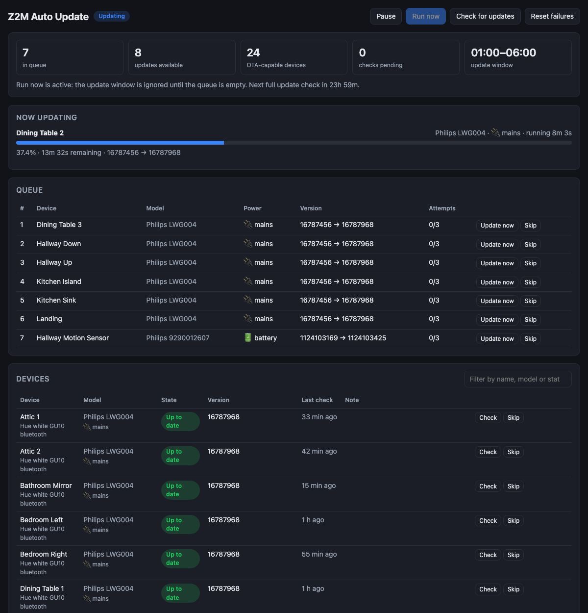

# Z2M Auto Update

[](https://github.com/parallax/z2m-auto-update/actions/workflows/build.yml)

A Home Assistant add-on (and standalone container) that installs [Zigbee2MQTT](https://www.zigbee2mqtt.io/) OTA firmware updates **one device at a time**.

Zigbee2MQTT will happily start every pending OTA update at once. On a big network that saturates the mesh, updates stall, and half of them fail. This add-on keeps a queue and works through it patiently.

- Sequential updates (or a small number in parallel) with a cooldown between them
- Mains-powered devices first, battery devices last
- Optional overnight update window
- Allow and deny lists by name, model, vendor or IEEE address
- Start and stall timeouts, retries with back-off, and it notices updates started elsewhere
- Throttled, one-at-a-time update checks instead of blasting the whole network
- A status page in the Home Assistant sidebar showing the queue, progress and a log
- Home Assistant entities via MQTT discovery: status, queue length, progress, a pause switch and run/check buttons



## Install in Home Assistant

1. In Home Assistant go to **Settings → Add-ons → Add-on store → ⋮ → Repositories** and add `https://github.com/parallax/z2m-auto-update`.
2. Install **Z2M Auto Update**. It uses the Mosquitto add-on's broker automatically; set `mqtt_host` and friends only if you run another broker.
3. Start it and open it from the sidebar.

The add-on talks to Zigbee2MQTT purely over MQTT, so it works with Zigbee2MQTT running as an add-on, in Docker, or anywhere else. It needs Zigbee2MQTT 2.x.

## Run standalone

```bash
docker run -d --name z2m-auto-update -p 8099:8099 -v z2m-auto-update:/data \
  -e Z2M_AU_MQTT_HOST=mqtt.local -e Z2M_AU_MQTT_USERNAME=user -e Z2M_AU_MQTT_PASSWORD=secret \
  ghcr.io/parallax/z2m-auto-update:latest
```

Every option in [the add-on docs](z2m_auto_update/DOCS.md) can be set as an environment variable prefixed `Z2M_AU_` (upper-case, lists comma-separated). See [docker-compose.yml](docker-compose.yml).

## Options and behaviour

See [z2m_auto_update/DOCS.md](z2m_auto_update/DOCS.md) for every option, the MQTT interface and troubleshooting.

## Development

```bash
cd z2m_auto_update
python -m venv .venv && . .venv/bin/activate
pip install -e ".[dev]"
pytest
ruff check .
Z2M_AU_MQTT_HOST=mqtt.local Z2M_AU_STATE_FILE=state.json python -m z2m_auto_update
```

The engine in `z2m_auto_update/engine.py` is a pure state machine with no I/O, so all the queueing, timeout and retry rules are covered by fast unit tests. `runner.py` wires it to MQTT and `web.py` serves the UI.

Releases: bump `version` in `z2m_auto_update/config.yaml` and `pyproject.toml`, add a changelog entry, and push to `main`. The workflow builds a multi-arch image and pushes it to `ghcr.io/parallax/z2m-auto-update` tagged with that version.

## Credits

Inspired by [fabicodes/zigbee2mqtt_ota_updater](https://github.com/fabicodes/zigbee2mqtt_ota_updater), a script that proved the approach. This is a from-scratch rewrite.

## License

MIT
